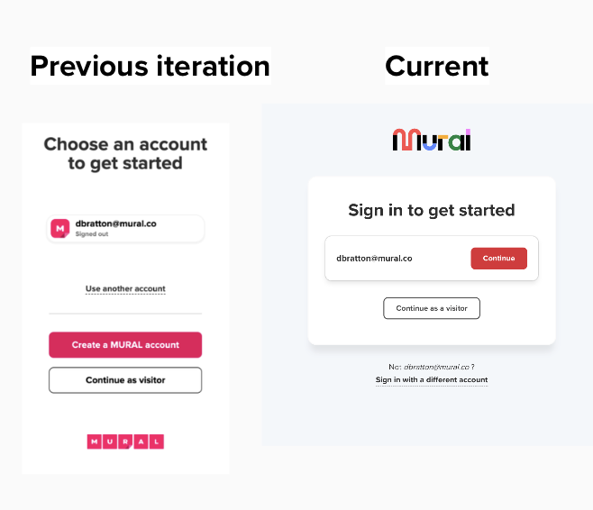

---
# -----------------------------------------------------------------------------
# Case study template.
#
# To use: copy this file to `projects/<slug>.md`, update the front matter
# below, and replace the body sections with your content. Then add a card
# on `index.html` that links to `/projects/<slug>.html`.
#
# The `description` field below is the single source of truth for:
#   - <title> tag
#   - <meta name="description">
#   - <meta property="og:description">
#   - <meta name="twitter:description">
# Edit it in ONE place and all four update on the next build.
# -----------------------------------------------------------------------------

layout: case-study

title: "Increasing user acquisition from Microsoft Teams by >100%"

description: "How mapping the Teams entry funnel as the squad's own PM-led analyst and reframing sign-up as a live-meeting decision turned Mural's Microsoft Teams integration from a leaky top-of-funnel into a significant acquisition and monetization channel."

role: "Senior Product Manager & Analyst"
company: "Mural"
timeline: "Q1 2023"

og_type: article

permalink: /projects/msft-teams-user-acquisition.html
---

## TL;DR

Mural's Microsoft Teams integration was generating massive top-of-funnel traffic — every meeting a host shared a mural, every participant landed on our sign-in/up page — but conversion into real accounts was extremely low. Most users chose *"enter as a visitor"* because, mid-meeting, it was literally one click. The alternative was clicking through a heavy onboarding flow which was not fit for this context. The integration was functioning as a visitor-generation machine, not an acquisition channel. It was a huge missed opportunity.

With no centralized analytics team supporting the squad, I owned the analysis myself. I started by mapping the screen-by-screen flow for every user type (host, participants with an existing account, participants without an account). I used this flow to calculate the funnel and the drop off rate at each step. I found that the top of the funnel was performing poorly: >90% of users did not sign up for an account in this context. The screen-by-screen flow also illustrated that the sign-up flow was built for quiet-moment onboarding (questionnaire and home-workspace selection). It also showed that users were not automatically returned to Teams after signing up, so they had to switch back and log in manually. **Most users weren't signing up at all and those who did had a poor and confusing experience**.

I worked with engineering to build an **"account chooser"** integration component with a simplified landing screen and a **just-in-time (JIT) provisioning** flow that pulled the user's email from Teams, pre-filled the sign-up, skipped onboarding, and returned them into the mural inside the same meeting — in one click. **The first iteration grew acquisition from Teams by >100%**. A second design iteration simplified the choices for the user which increased acquisition by another **16%**. The component was then productized for **Zoom, Webex, and Google Meet**, and shifted how the company thought about integrations: from feature add-ons to valuable user acquisition and monetization channels.

## Situation

Mural is a digital whiteboard for the enterprise. One of our highest-volume top-of-funnel surfaces was the Microsoft Teams integration: a host shares a mural during a live meeting, and every participant who isn't already authenticated lands on a Mural sign-in/up page before they can see the content on the canvas.

On paper, this was a great acquisition surface — warm users, real intent, a concrete reason to use the product in the next 30 seconds. In practice, the integration was leaking badly. A large share of participants tapped **"enter as a visitor"** instead of signing up, because in the middle of a live meeting visitor entry was the single-click path and every alternative required reading, typing, and waiting. We'd also been getting direct user feedback that creating a new Mural account *from* Teams was difficult. The integration was producing traffic and sessions, but very few authenticated accounts — which meant very little retention, very little monetization, and very little insight into the enterprise footprint behind the visitor volume.

Stakeholder concerns clustered in three places:

- **Growth** saw Teams as a lucrative acquisition channel that wasn't acquiring.
- **Enterprise** cared that visitor-heavy sessions were hiding the true footprint of Mural usage inside customer accounts.
- **The integrations team** wanted a reusable pattern — if we solved it in Teams, the same gap was waiting in Zoom, Webex, and Google Meet.

One important piece of context shaped how the analysis had to be run: **our squad did not have a centralized analytics team supporting it**. As PM, I was responsible for defining the right metrics and doing the analysis myself.

## Task

My job was to evaluate the sign-in/up flow for users coming into Mural via Teams and figure out how to make it meaningfully easier to sign in or create an account — without blocking the users who legitimately needed visitor entry. Concretely, that meant:

1. **Define the right metrics.** Acquisition alone was too blunt. I needed metrics that captured account creation, activation inside the mural, and downstream retention. This way we kept the full user journey and the value of those acquired users in sight. Otherwise, we could celebrate a "win" on increasing user acquisition without knowing if these users actually continued using the product later.
2. **Map the actual funnel.** Different user types (host, existing-account participant, new-account participant, visitor) took different paths. Any fix had to come from understanding all four, not just the one we were optimizing.
3. **Design for live-meeting context, not marketing context.** The page was appearing while another human was talking and waiting. Flows that made sense for quiet-moment onboarding were not designed for this situation.
4. **Build a reusable integration pattern.** Whatever we shipped had to travel to Zoom, Webex, and Google Meet with minimal rework.

## Analysis

**Owning the measurement work.** With no central analytics team, I spec'd the metrics framework myself and worked with engineering to make sure we could measure the funnel cleanly. I landed on three primary metrics:
* Weekly count of new user sign ups from Teams: I needed to increase this
* % of new sign ups who activated (took an action in Mural within 24 hours): I expected this to *at least* be stable to the current rate.
* **1d / 7d / 30d retention rate**: The % of new users who returned to the product the within the next 1 day, within the next week, and within the next month. I expected this to *at least* be stable to the current rate.
    * I had to set stakeholder expectations with this metric because I observed retention rate to not be as good as users who come to the product and complete onboarding on their own time. The focus of this effort was to get users further down the funnel to this step. Even at a lower retention rate, we had a large volume of users we could transfer to this stage of the funnel.

I segmented users to only focus on Enterprise accounts as that is the acquisition channel that we wanted to monetize and accounted for a large potion of Mural's user base.

I could also compare these success metrics to the general population of new Mural sign ups to understand how well the Teams funnel performed against this benchmark.

**Mapping the funnel screen-by-screen, by user type.** Before touching the design, I documented the step-by-step path that each user type took through the integration: the meeting host sharing a mural, a participant with an existing Mural account, a participant without an account who needed to sign up, and a participant who only wanted to (or was only permitted to) enter as a visitor. Laying the four flows side-by-side was what exposed how much of the "sign-up" flow was inherited from standalone web onboarding without ever being adapted for the live-meeting context.

Three findings changed the conversation:

**Finding 1: Sign-up was designed for a totally different moment.** New-account participants were being routed into the *full standard onboarding flow*: a questionnaire, plus selecting a "home" workspace. Those are reasonable things to ask a user who has come to Mural on their own time to set up an account. They are unreasonable things to ask a user who is in the middle of a live Teams meeting and just wants to see the mural their host is presenting. The flow was built for user patience and time it could not assume for this situation. It's no wonder **>90% of users entered murals as anonymous visitors instead of signing up for an account**.

**Finding 2: Even if you finished signing up, you weren't where you needed to be.** After completing the web-based sign-up, users were *not automatically logged back into Teams*. They had to manually switch tabs/windows back to Teams and sign in again with their new credentials before they could actually join the mural. In a context defined by ASAP, this was the highest-cost step in the whole journey, and it lived *after* a user had already opted in. It was a strong incentive to not even start. Thus, **even motivated users were confused after onboarding and frequently contacted support for help**.

**Finding 3: Time pressure, not preference, was driving visitor entry.** Segmenting the top-of-funnel by entry context showed exactly what the first two findings predicted: users coming in from live Teams meetings were dropping at the sign-up stage at a much sharper rate than users coming in from any other surface. Visitor entry wasn't a considered choice; it was a panic button for people who had <10 seconds of attention to spare and a presenter waiting on them. Any design that didn't prioritize speed was going to lose every time.

**Hypothesis**: I believed that if we could provide a means of signing up for an account during a live Teams meeting we could increase new user acquisition from this channel. I would know that was true when I observed more users creating new accounts from Microsoft Teams. To measure this I monitored
weekly count of new user sign ups from the Teams integration. I also monitored guardrail metrics for funnel conversion and retention rate of these new users.

## Recommendation

Based on the funnel work, I recommended building a new, dedicated integration component — we called it the **account chooser** — with three core design moves:

1. **A simplified landing screen designed for <10 seconds of attention.** One clear primary action, a visible secondary for "already have an account," and visitor entry available but quiet. No marketing copy, no feature tour — the page's only job is to route the user into the mural as fast as possible.
2. **Just-in-time (JIT) provisioning for new accounts.** Pull the user's email from Teams, pre-fill the sign-up form, skip the questionnaire and home-workspace selection, and return them directly into the mural inside the active meeting. A one-click path from "never used Mural" to "authenticated and collaborating," without leaving the meeting context.
3. **Preserve visitor entry as a real fallback.** Available for anyone who needs it (including users whose permissions require it), but no longer competing for the primary slot on the page.

The case for the investment was grounded in the metric framing: authenticated users had access to more product functionality than visitors, which meant a better in-meeting collaboration experience *and* more users progressing through the funnel. downstream retention and monetization surface area. We wanted to increase top-of-funnel conversion while unlocking the product value that visitor entry was silently cutting users off from.

## Rollout

We shipped the account chooser and JIT flow as a structured experiment, instrumenting the funnel carefully and watching both the lift metrics and the guardrails on the live-meeting experience (we did not want to win on signups at the cost of degrading the host's session). Rollout ran in two design iterations, each measured before we moved on:

**Iteration 1 — JIT provisioning and the account chooser.** The first cut shipped the simplified landing screen and the one-click JIT sign-up flow. This was the big unlock: users coming in from a live Teams meeting could now sign up, authenticate, and land inside the mural without leaving the meeting or re-logging-in to Teams. **The first iteration lifted acquisition rate from the Teams integration by >100%** while activation retention rates remained flat. We had successfully shifted a large volume of users further down the funnel.

**Iteration 2 — optimizing the design.** After the first release was live, the funnel data surfaced a second-order problem. Even with the JIT flow in place, the landing screen still had a prominent **red *"Create a Mural account"*** button that wasn't the action we wanted most users to take (see left side of the screenshot below). It routed them into a manual, non-JIT sign-up path. Users were clicking it anyway, because its visual weight read as the primary CTA. *That's when a lesson landed: at the speed people decide on this page, visual priority is extremely important. No amount of supporting copy recovers from a CTA that looks like the answer but isn't.*

We redesigned the page to promote the expedited JIT path to the unambiguous primary action and demoted the heavier manual account-creation path to a secondary option for users who genuinely needed it. That single iteration delivered **+16% signups and a 15% drop in bounce rate** on top of the first release's lift.

**Packaging the pattern.** Once the Teams design stabilized, we productized the account chooser component and shipped it into our **Zoom, Webex, and Google Meet** integrations. Having a standard component meant each new platform launched with a flow that had already been tested in a live meeting context.

## Results

- **Primary metric — Teams acquisition (iteration 1):** **>100% growth** in acquisition from the integration channel. Visitors were now creating new accounts.

- **Activation rate:** Although the target I had for activation rate was for it to remain stable, we observed a **>10% increase**. This was because authenticated users had access to meaningfully more product functionality than visitors so they were more likely to perform an activating action after creating an account.

- **Retention rate:** There was no change in retention rate for the newly acquired users. This was expected as we were focused on optimizing conversion at the top of the funnel. 

- **Platform spread:** The account chooser pattern was subsequently shipped to **Zoom, Webex, and Google Meet**, each of which benefited from the learnings from Teams without having to re-run experiments. We did monitor metrics to ensure we didn't miss any nuances of the user population or product experience in these other products.
- **Narrative shift:** This project re-framed integrations at Mural from *feature add-ons* to *measurable acquisition and monetization channels*.

## Reflection

The thing I keep coming back to on this project is that **context sets the budget for attention, and the design has to respect the budget**. Everything about the pre-project onboarding flow made perfect sense for a user onboarding on their own time. It did not serve a user staring at a share screen while a host waited.

The second-iteration red-button lesson is the sharper one, though. It's easy to ship a page where the visual hierarchy quietly disagrees with the intended strategy, especially when the loudest component looks handsome in isolation. The test isn't whether a CTA is well-designed on its own; it's whether *the thing you want users to do* is the thing the page visually recommends. Watching users click the wrong button at scale is a humbling and useful reminder to treat visual weight as a strategic decision, not a styling decision.

Working as the squad's own analyst was another formative part of this project. It pushed me to own the metrics definition, the instrumentation, and the funnel analysis directly, and I think the project was better for it; nobody else was close enough to the product context to have spotted the 'why' behind poor top-of-funnel conversion.

If I were doing it again, I'd have pulled the screen-by-screen flow map earlier. The "manual re-login back into Teams after sign-up" issue was the single biggest unlock in the JIT redesign, and we didn't notice it until I walked the four user-type flows side-by-side on paper. Some problems only show up when you force yourself to describe the *whole* journey, step by step, rather than trusting the mental model you walked in with.

There's also a second chapter to this project that we only partially tackled. Once enterprise customers started arriving through this funnel at real volume, we ran into a new set of problems around **SCIM provisioning, alias emails, and access permissions**: the kind of issues that don't appear until your sign-up flow is actually working. That's a case study of its own.

Finally, downstream retention was still an opportunity after this project. We got new users in the product, but we skipped the normal onboarding to do it. I believed the lack of onboarding was a contributor to retention rate for these users being lower than the general population. Later on, we implemented ways to put these users into the onboarding flow at a better time and targeted them with Teams-specific marketing which improved retention rate.

**Skills demonstrated:** product discovery, product analytics (metrics definition, instrumentation spec, funnel analysis), screen-by-screen user-type flow mapping, behavioral segmentation by entry context, onboarding design, paired-metric experimentation, iterative design, stakeholder management, cross-platform pattern productization, user acquisition and monetization.

